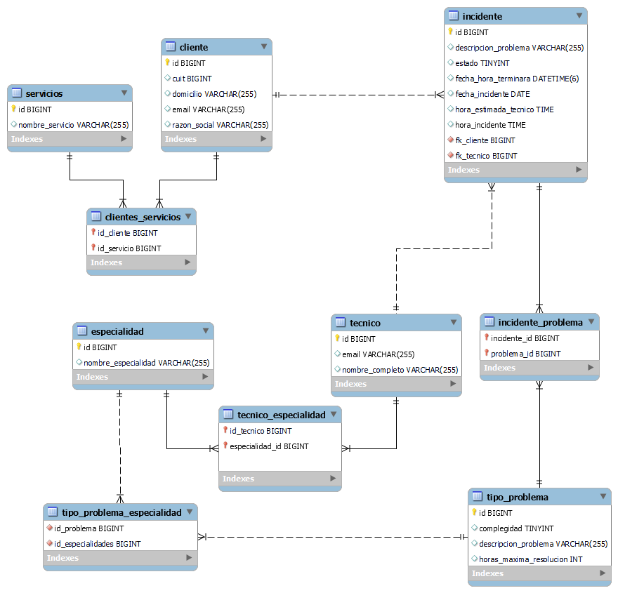

# <h1 align="center" >Trabajo Integrador - Argentina Programa Intemedio</h1>
<h2 align="center"> Consigna del Trabajo Practico </h2>
<h3 align="center">Sistema de Reporte de Incidentes</h3>
<h5>Contexto general</h5>

Una importante empresa de soporte operativo solicita el diseño y desarrollo de un sistema que le permita la generación y seguimiento de los incidentes que se presentan.
La empresa en cuestión se dedica a brindar soporte operativo sobre distintas aplicaciones (SAP, Tango, etc.) y sistemas operativos (Windows, MacOS, Linux Ubuntu).
El área de RRHH se encarga de realizar las altas, bajas y modificaciones de los técnicos que se encargan de resolver los incidentes reportados.
Cada técnico tiene una o varias especialidades y solo se le pueden asignar incidentes que coincidan con las mismas.
El área comercial es responsable de incorporar nuevos clientes a la empresa. Administra las altas, bajas y modificaciones de los datos de cada uno de ellos.
Finalmente, la mesa de ayuda es responsable de atender las llamadas e ingresar al sistema los incidentes reportados.

<h5>Ciclo de vida de un incidente</h5>

Cuando un cliente llama, la mesa de ayuda le solicita los datos para identificarlo (razón social, CUIT) y los ingresa en el sistema para que el mismo le muestre los servicios que el cliente tiene contratados.
El operador (de la mesa de ayuda) solicita que le informen por cuál de esos servicios desea reportar un incidente, junto con una descripción del problema y el tipo del problema.
Al ingresar el incidente, el sistema devuelve un listado de técnicos disponibles para resolver el problema. El operador selecciona uno de los técnicos disponibles y el sistema le informa el tiempo estimado de resolución. Luego, informa al cliente que el incidente ha sido ingresado y la fecha posible de resolución.
Al confirmarse el incidente, el sistema debe enviar una notificación al técnico informándole que tiene un nuevo incidente para resolver.
  Cuando el técnico atiende y resuelve el incidente, lo debe marcar como “resuelto”, indicando las consideraciones que crea necesarias. Cuando esto ocurra, el sistema debe enviar un email al cliente informándole que su incidente ya está solucionado.

<h5>Otros requerimientos</h5>

  ●	El sistema debe permitir al área de RRHH emitir diariamente reportes con los incidentes asignados a cada técnico y el estado de los mismos.
●	El sistema debe permitir que el operador agregue “un colchón” de horas estimadas para la resolución del problema, si el mismo es considerado “complejo”.
●	El sistema debe permitir el alta de incidentes que contengan un conjunto de problemas de un mismo servicio. Dichos problemas deben estar relacionados.
●	El sistema debe dar la posibilidad de informar:
○	Quién fue el técnico con más incidentes resueltos en los últimos N días
○	Quién fue el técnico con más incidentes resueltos de una determinada especialidad en los últimos N días
○	Quién fue el técnico que más rápido resolvió los incidentes

<h5>Consideraciones</h5>

●	Cada tipo de problema particular puede ser solucionado por una o varias especialidades.
●	Cada operador puede definir, optativamente, su tiempo estimado de resolución por defecto por tipo de problema; el cual tendrá que ser menor al tiempo máximo de resolución definido para el tipo de problema.
●	Cada técnico puede definir su medio preferido de notificación, los cuales pueden ser: Email o WhatsApp. No están definidas las bibliotecas que se utilizarán para realizar estas notificaciones.

<h5>Metodologia</h5>

Se propone una metodología de trabajo iterativa e incremental. Para esto, el TP se divide en tres entregas, las cuales se realizarán a través del envío del link al repositorio de trabajo por medio del Campus Virtual en la fecha estipulada por el Docente del curso.
En la última entrega (coincidente con la tercera) se deberá exponer el TP frente al curso, mostrando la solución generada y justificando las decisiones tomadas.

<h2>Entrega 1</h2>

En esta primera iteración nos encargaremos de modelar, a nivel datos y objetos, una solución al dominio presentado. Además, comenzaremos con el proceso de codificación de la solución.

En particular, en esta entrega se solicita:
1.	Modelo de datos (DER en el caso de utilizar conexión con BD) y UML que brinde solución al dominio.
2.	Código con modelado de clases. El código debe estar subido a un repositorio de GitHub.
Es necesario que el proyecto Java sea creado como un proyecto “Maven” para poder añadir algunas dependencias. Se recomienda la utilización de la dependencia de Lombok para facilitar la tarea repetitiva de generación de Setters y Getters de las clases.

**<h2 align="center" >Diagrama Entidad Relacion</h2>**

**<h2 align="center" >Diagrama UML</h2>**

